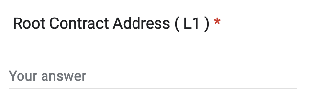
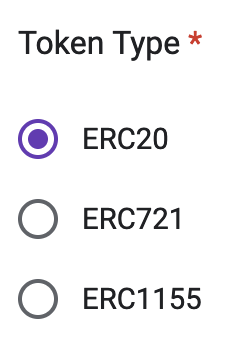

Token mapping is important in order to enable the transfer mechanism for the said token between Ethereum and Polygon PoS.

!!! info

    - For more information on how bridging works in the background, see [the doc available here](../index.md).
    - Thinking about bridging another popular token? Refer to the [reference guide on Polygon Portal](../../../../tools/wallets/portal.md).

## Steps to submit a mapping request

1. To submit a request for mapping your token on Polygon PoS, start by navigating to [the Google form available here](https://docs.google.com/forms/d/e/1FAIpQLSeq8HTef2dYpRx35_WWYhyr4C146K9dfhyYJQcoD1RuTTVABg/viewform).

2. Choose a "Network" option depending upon the chain on which you're looking to map your token. This would be **"Sepolia <> Polygon Amoy"** for testnet, and **"Ethereum <> Polygon PoS"** for mainnet.

  

3. Next, input the contract address for the token contract that you've deployed on Sepolia/Ethereum mainnet in the "Root Contract Address (L1)" field.

  

4. Choose the correct "Token Type" for your token. i.e., [ERC-20](https://eips.ethereum.org/EIPS/eip-20) for a standard token, [ERC-721](https://eips.ethereum.org/EIPS/eip-721) for an NFT, or [ERC-1155](https://eips.ethereum.org/EIPS/eip-1155) for a multi token.

  

5. Finally, select "Submit" to send in your request. The Polygon team will review your mapping request, and get back to you with a response. This generally takes up to 7 days.

!!! info "Token list"

    - Check out the list of supported tokens available in JSON format by following this URL: https://api-polygon-tokens.polygon.technology/tokenlists/polygonTokens.tokenlist.json
    - Once approved, your token will be added to the above list!
